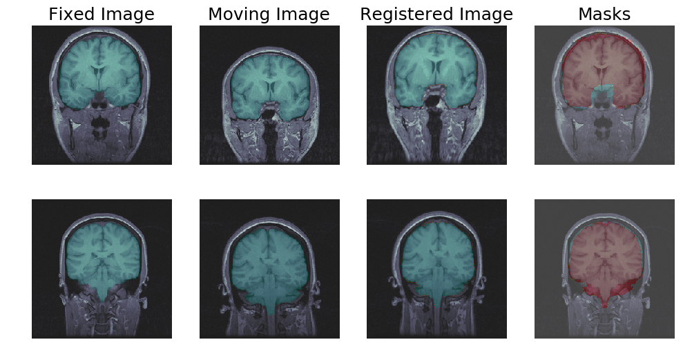
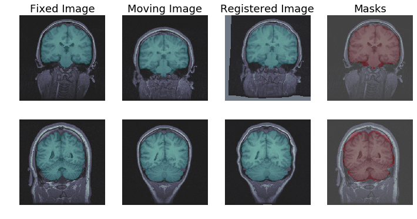

# DIR
Project on deformable image registration for DSP course at UCT

## Baseline 
The baseline model comes from the open source [SimpleElastix Medical Image Registration Library](https://simpleelastix.github.io) and does not leverage deep learning in its approach to solving the image registration task.

## Learning Approach
The learning approach uses a convolutional architecture as outlined [here](https://arxiv.org/abs/1711.08608).

## Results

|Method | Jacc | MI | Run time [s] |
|---|---|---|---|
|No Registration | 0.934 | 0.476 | - |
| Classical | 0.977 | 0.951 | 5.61 |
| Learning | 0.975 | 0.664 | 0.273 |

### Learning based results

### Classical based results

