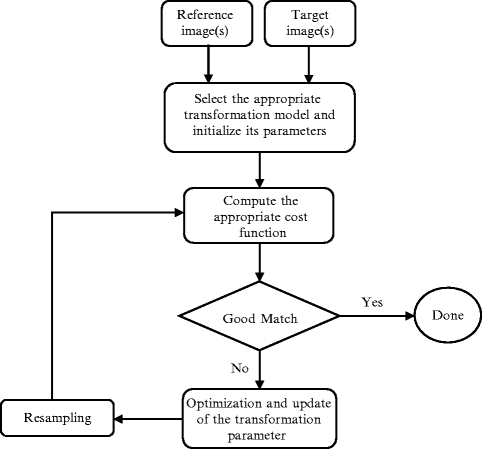
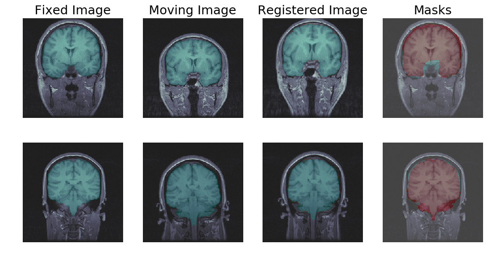
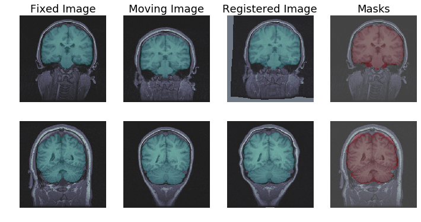

# Deformable Image Registration

Project on deformable image registration for our final year DSP course at UCT. Image registration is the task of aligning two or more images with temporal or modal differences in order to maximize the spatial correspondence between them. It is a problem that is common in the field of medical imaging analysis as images of the same organs are taken at different points in time or have different modalities (CT, MRI, PET). The aim of the project was to determine whether deep learning methods provided any gains, significant or otherwise, over classical methods.

| Contributors |
|--------------|
| Senyo Simpson|
| [Thomas Tumiel](https://github.com/Tom2718)|

## Dataset

The dataset used was the [LPBA40 Subjects Native Space](https://resource.loni.usc.edu/resources/atlases-downloads/) which is one of the LONI atlases available for download. This dataset compromises of 40 patients with brain MRI images and ground truth segmentation masks.

## Classical Approach

The classical approach was implemented using the open source [SimpleElastix Medical Image Registration Library](https://simpleelastix.github.io). It uses affine and b-spline transformations in order to perform registration. Classical approaches to image registration use a cost function optimization approach to register images. It is an iterative approach where at each instance, the cost function is evaluated and the image is transformed so as to minimize it until it reaches an acceptable level. This process can typically be quite lengthy, somewhere in the region of 5-6 seconds per iteration on a decent CPU. An overview of this can be seen in the image below

## Learning Approach

The learning approach uses a convolutional architecture as outlined in the paper [Unsupervised End-to-End Learning for Deformable Medical Image Registration](https://arxiv.org/abs/1711.08608). It is based off the [FlowNet2](https://arxiv.org/abs/1612.01925) model and the [Spatial Transformer Network](https://arxiv.org/abs/1506.02025). Pretrained weights were used with the FlowNet2 model which can be found [here](https://github.com/NVIDIA/flownet2-pytorch). The specific model is FlowNet2-S.

The gist of this approach is to use a FCN (FlowNet2) to compute a deformation field between the two images and use that field to find parameters of a transformation using a STN. The transformation used in this model was a thin plate spline.

The neural network based approach, once trained, can perform image registration of new images in one shot. This allows for predictions to be sped up by orders of magnitude. On a fairly decent CPU, this took around 0.2-0.4 seconds.

## Quick Terminology

Fixed image - the image we wish to align/register to. Could also be called the target image  
Moving image - the image we wish to deform in order to align to the fixed image  
Registered image - the image that is a result of warping the moving image (to match the fixed image)

## Results

In order to evaluate the registration, the metrics used were the jaccard coefficient, commonly known as intersection over union (iou), mutual information (mi) and for brevity sake, the run time of each approach.

In order to calucalte the jaccard coefficient, the segmentation mask of the moving image was warped to match the fixed image segmentation mask. The jaccard coefficient was then calculated using the fixed image mask and the registered image mask.

|Method | Jacc | MI | Run time [s] |
|---|---|---|---|
|No Registration | 0.934 | 0.476 | - |
| Classical | 0.977 | 0.951 | 5.61 |
| Learning | 0.975 | 0.664 | 0.273 |

### Learning based results

### Classical based results

